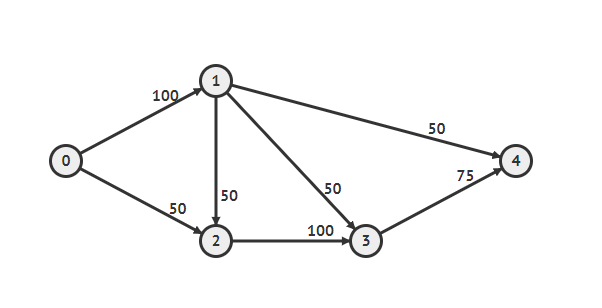
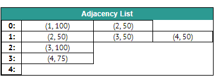

# Graph Theory
[](https://central.sonatype.com/artifact/dev.loqo71la/graph-theory/0.0.1)
[](https://github.com/loqo71la/graph-theory/actions/workflows/coverage.yml)
[](https://codecov.io/gh/loqo71la/graph-theory)
[](https://github.com/loqo71la/graph-theory/blob/main/LICENSE)

**graph-theory** is a library to represent graphs (directed graph for now), and it manages the vertices and edges through an adjacency list.


The default weight of the edges is 1, but it can be changed through the following list:



## Installation
Add the dependency if you are using Maven:
```xml
<dependency>
    <groupId>dev.loqo71la</groupId>
    <artifactId>graph-theory</artifactId>
    <version>0.0.1</version>
</dependency>
```
Or if you are using Gradle:
```groovy
implementation group: 'dev.loqo71la', name: 'graph-theory', version: '0.0.1'
```
## Usage
### Create a Graph
Initialize a generic Graph through the **AdjacencyListGraph** class.
```java
Graph<Integer> graph = new AdjacencyListGraph<>();
```
### Add Vertices
Add new vertices through the ``addVertex(T vertex)`` method.
```java
graph.addVertex(0);
graph.addVertex(1);
graph.addVertex(2);
graph.addVertex(3);
graph.addVertex(4);
```
### Get Vertices
Returns a list of added vertices.
```java
// [0, 1, 2, 3, 4]
graph.getVertices();
```
### Add Edges
Add a new edge between the **source** and **target** vertices using the methods: `addEdge(T source, T target)` or `addEdge(T source, T target, double weight)`.

`NOTE: If the vertices are not contained, it throws and InvalidParameterException`
```java
graph.addEdge(0, 1, 100);
graph.addEdge(0, 2, 50);

graph.addEdge(1, 2, 50);
graph.addEdge(1, 3, 50);
graph.addEdge(1, 4, 50);

graph.addEdge(2, 3, 100);

graph.addEdge(3, 4, 75);
```
### Get Edges
Returns a list of edges of the requested vertex.

`NOTE: If the vertex is not contained, it throws an InvalidParameterException.`
```java
// 1 -> [2, 3, 4]
graph.getEdges(1);
```
